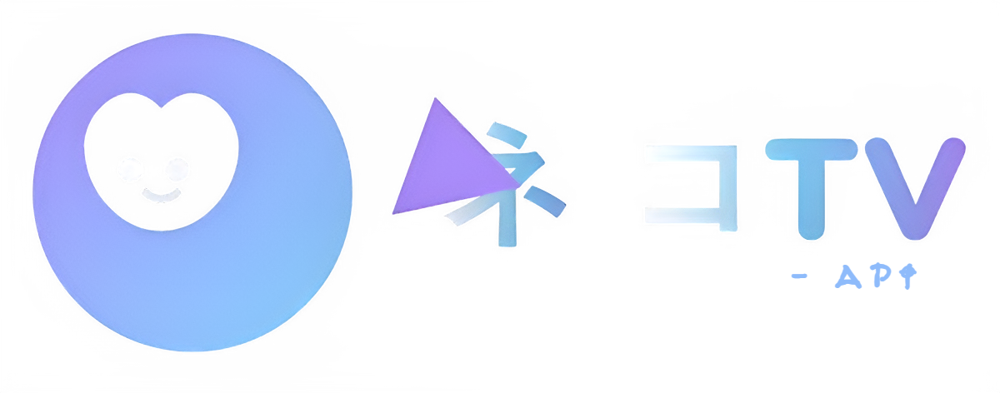

<!-- Title with gradient -->
<h1 align="center">
  <span style="background: linear-gradient(90deg, #a29bfc, #89bcf8); -webkit-background-clip: text; color: transparent;">
    📺 NekoTV-API
  </span>
</h1>

<p align="center">
  
</p>

---

<p align="center">
  NekoTV-API is a RESTful API that fetches anime content from <a href="https://hianimez.to" target="_blank">hianimez.to</a> using web scraping.  
  It provides endpoints to retrieve anime details, episodes, and streaming links.
</p>

> [!IMPORTANT]
> 1. No hosted version is provided; deploy your own instance for personal use.  
> 2. This API is unofficial and not affiliated with hianimez.to.  
> 3. Content belongs to their respective owners; this API demonstrates building a scraping-based API.

---

<h2 style="color:#a29bfc;">💻 Installation</h2>

### Prerequisites
- [Bun](https://bun.sh/docs/installation)  
- [pnpm](https://pnpm.io/) *(optional)*  

### Local Setup
1. Clone the repository:
```bash
git clone https://github.com/jsmat0m/NekoTV-API.git
```

2. Navigate into the project:
```bash
cd NekoTV-API
```

3. Install dependencies:
```bash
bun install
```

4. Start the server:
```bash
bun run dev
```

- The API runs at 👉 [http://localhost:3030](http://localhost:3030)

### Deploy on Render
[](https://render.com/deploy?repo=https://github.com/jsmat0m/NekoTV-API)

---

<h2 style="color:#a29bfc;">📚 Documentation</h2>

#### 1. `GET /api/v1/home` – Anime Home Page
```javascript
const resp = await fetch('/api/v1/home');
const data = await resp.json();
console.log(data);
```
- Returns spotlight, trending, top airing, most popular, new added, genres, and more.

#### 2. `GET /api/v1/animes/{query}/{category}?page={page}` – Anime List
```javascript
const resp = await fetch('/api/v1/azlist/0-9?page=1');
const data = await resp.json();
console.log(data);
```
- Valid queries: `top-airing`, `most-popular`, `completed`, `genre`, `az-list`, `subbed-anime`, `dubbed-anime`, etc.

#### 3. `GET /api/v1/anime/{animeId}` – Anime Detailed Info
```javascript
const resp = await fetch('/api/v1/anime/attack-on-titan-112');
const data = await resp.json();
console.log(data);
```
- Returns synopsis, episodes, genres, studios, rating, related anime, etc.

#### 4. `GET /api/v1/search?keyword={query}&page={page}` – Search Results
```javascript
const resp = await fetch('/api/v1/search?keyword=titan&page=1');
const data = await resp.json();
console.log(data);
```

#### 5. `GET /api/v1/search/suggestion?keyword={query}` – Search Suggestions
```javascript
const resp = await fetch('/api/v1/search/suggestion?keyword=clannad');
const data = await resp.json();
console.log(data);
```

#### 6. `GET /api/v1/episodes/{animeId}` – Anime Episodes
```javascript
const resp = await fetch('/api/v1/episodes/steins-gate-3');
const data = await resp.json();
console.log(data);
```

#### 7. `GET /api/v1/servers?id={id}` – Episode Servers
```javascript
const resp = await fetch('/api/v1/episode/servers?id=steinsgate-3::ep=213');
const data = await resp.json();
console.log(data);
```

#### 8. `GET /api/v1/stream?id={id}&server={server}&type={dub||sub}` – Streaming Links
```javascript
const resp = await fetch('/api/v1/stream?server=HD-2&type=dub&id=steinsgate-3::ep=214');
const data = await resp.json();
console.log(data);
```

---

<h2 style="color:#a29bfc;">👨‍💻 Development</h2>

- Pull requests and stars are welcome.  
- Report bugs or request features via [Issues](https://github.com/jsmat0m/NekoTV-API/issues).  
- Use this API for your frontend project: [NekoTV](https://github.com/jsmat0m/NekoTV)

---

<h2 style="color:#a29bfc;">✨ Contributors</h2>

[](https://github.com/jsmat0m/NekoTV-API/graphs/contributors)

---

<h2 style="color:#a29bfc;">🤝 Thanks</h2>

- [consumet.ts](https://github.com/consumet/consumet.ts)  
- [api.consumet.org](https://github.com/consumet/api.consumet.org)

---

<h2 style="color:#a29bfc;">🙌 Support</h2>

If you like this project, **leave a star** 🌟 on GitHub:

[](https://github.com/jsmat0m/NekoTV-API)
